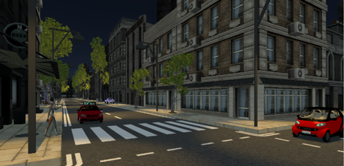
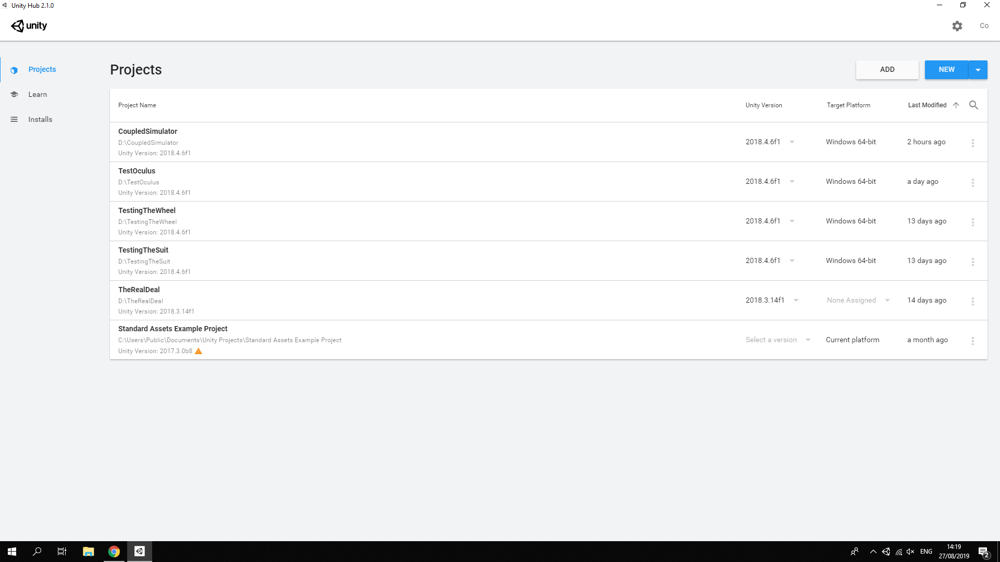
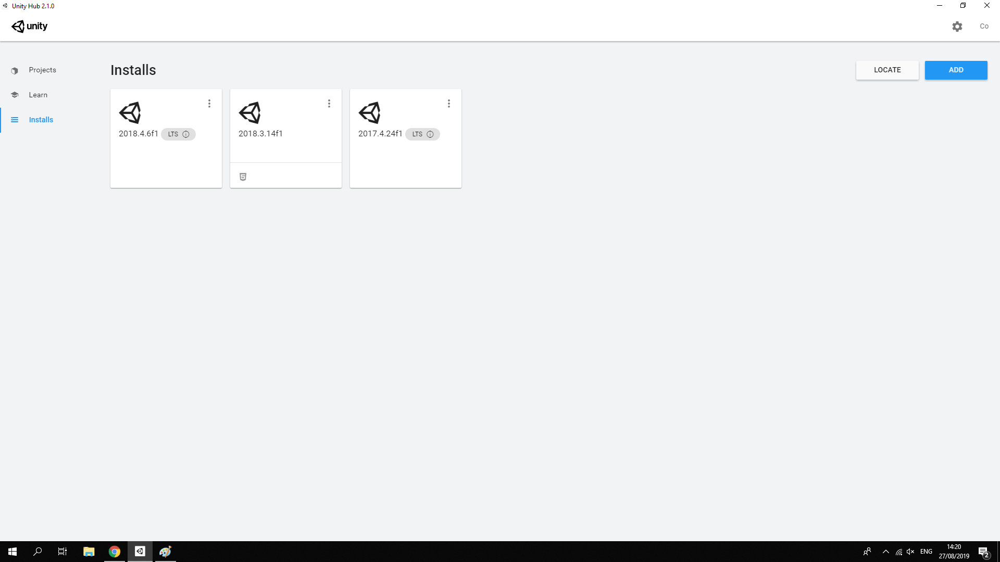
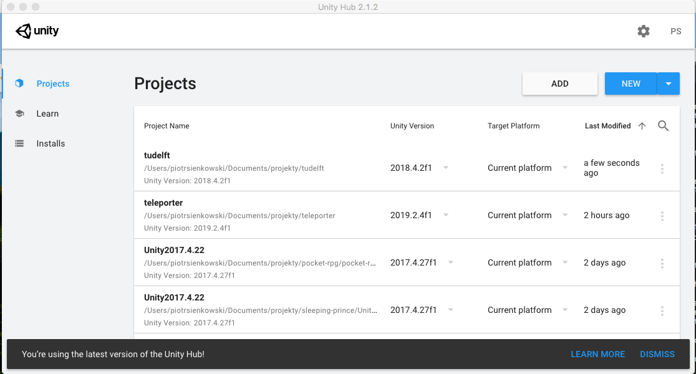

# Coupled simulator for research on driver-pedestrian interactions made in Unity.
## Description of simulator
### Environment

The coupled simulator supports both day and night-time settings; Figure above shows a view of the night mode. Figure below shows the top view of the environment: a model of a city centre containing a road network with ten intersections with traffic lights and 34 zebra crossings. Traffic lights can be turned on and off before the experiment or programmatically in real-time. Some parked cars, trees, advertisements, and other static objects are placed throughout the city. Small, medium, and large cars are supported for driving and are represented by the models similar to Smart Fortwo, Pontiac GTO, and Nissan Datsun, respectively. Cars that are not controlled by the human participants can be instructed to follow a trajectory before the experiment or can be programmed to respond to other road users. The advertisements are programmable and can be used as visual distractions (e.g., for research on visual attention distribution).

## Installing the project
Current support only for Windows (Windows 10). After checking out the project, you need to use Unity Hub to run it with the correct version of Unity.

The current version to be used is 2018.4.6f1, see figure below for the view of the installed versions.

## Running the project

Select the project from the Unity Hub projects list. Wait until the project loads in.
If it is not on the Unity Hub list (it is the first time you are running the project), it has to be added first - click Add and select a folder containing project files.

## Configuring the project
The world in the simulator 

A central point for configuring the project is _Managers_ game object from the _StartScene_ scene. It has two components:
- _PlayerSystem_ - gathering references to player avatar prefabs,
- _NetworkingManager_ - gathering references to experiment definitions and elements spawned during networked experiment runtime (currently only waypoint-tracking cars - _AICar_).

The experiment is defined solely with prefab containing the _ExperimentDefinition_ component in the root object.
To edit the experiment definition double click prefab in the _Project_ window.

Prefab will be opened in edit mode along with the currently defined _Regular Prefab Editing Environment_. When defining the experiment it is worth setting _Regular Prefab Editing Environment_ variable to the Unity scene defined in the experiment (_Edit -> Project Settings -> Editor -> Prefab Editing Environments -> Regular Environment_).

_ExperimentDefinition_ component defines the following fields:
- _Name_ - the name of the experiment
- _Scene_ - Unity scene name to be loaded as an experiment environment
- _Roles_ - list defining roles that can be taken during an experiment by participants
- _Points of Interest_ - static points that are logged in experiment logs to be used in the log processing and analysis
- _Car Spawners_ - references to game objects spawning non-player controlled cars

_Points of interest_ is a list of _Transform_ references.
_CarSpawners_ list references game objects containing component inheriting from _CarSpawnerBase_. It defines, with overridden _IEnumerator SpawnCoroutine()_  method, spawn sequence (see _TestSyncedCarSpawner_ for reference implementation). Car prefabs spawned by the coroutine with _AICar Spawn(AICar prefab, bool yielding)_ method must be one of the referenced prefabs in _AICarSystem_ list on _NetworkManager_ component. 

### Configuration of agents
Roles field is a list of _ExperimentRoleDefinition_ struct's defining experiment roles with the following data fields:
- _Name_ - short name/description of the role
- _SpawnPoint.Point_ - defines where player avatar will be spawned
- _SpawnPoint.Type_ - a type of player avatar. It may be either _Pedestrian_, _Driver_, _Passenger_ of an autonomous car.

#### Adding and removing agents
To add a new agent either increase the size of Roles array or duplicate existing role by right-clicking on the role name and selecting Duplicate from the context menu.

To remove the agent right click on the role name and select Delete from the context menu or decrease the list size removing end entries that don't fit the resized list.

#### Configuration of starting location of agents
Add a new game object to the prefab and set its position and rotation.
Drag the newly created object to the _SpawnPoint.Point_ in role definition.

#### Configuration of the pedestrian agent
No additional configuration is needed for pedestrian type agents.

#### Configuration of the driver agent
For _Driver_ role following field has to be defined:
- _CarIdx_ - points to a car prefab on the _AvatarPrefabDriver_ (field on _PlayerSystem_ component) list that will be spawned for this role. 

#### Configuration of the passenger agent
For _Passenger_ type of agent following additional fields has to be defined:
- Car Idx - indicates car prefab that will be spawned for this role. Selected prefab is the one on the indicated index on PlayerSystem lists (for PassengerAvatarPrefabPassenger list)
- Three _DriverHMI_ fields - define which HMI prefab to spawn on indicated spots
- _AutonomusPath_ - references game object defining waypoints for the autonomous car via WaypointCirciut component

### Configuration of non-playable characters

Paths for both non-playable pedestrians and vehicles are defined with WaypointCircuit component.
To add waypoint press plus sign and drag waypoint Transform into the newly added field.
To remove waypoint press a minus sign next to the waypoint.
To reorder waypoint click up/down signs next to a waypoint.
To change the position of a waypoint select waypoint transform and move it do the desired position.

#### Configuration of the movement of the non-playable vehicles
Additionally, for vehicles, SpeedSetting along with Collider component might be used to further configure tracked path. 

#### Configuration of daylight conditions

DayNightControl component helps to define different experiment daylight conditions. It gathers lighting-related objects and allows defining two lightings presets - Day and Night, that can be quickly switched for a scene. This component is intended to be used at the experiment definition setup stage. When the development of the environment is complete, it is advised, to save the environment into two separate scenes (with different light setups) and bake lightmaps.

#### Configuration of traffic lights

Creating a traffic street lights system is best started with creating an instance of _ExampleStreetLightCrossSection_ and adjusting it. 
Traffic light sequence is defined in _StreetLightManager_ component as a list of _StreetLightEvents_. Events are processed sequentially. Each event is defined with the following fields:
- Name - descriptive name of an event
- Delta Time - relative time that has to pass since previous event to activate the event
- CarSections - cars traffic light group that the event applies to
- PedestrianSections - pedestrian traffic light group that the event applies to
- State - state to be set on the lights specified by sections, LOOP_BACK is a special state that restarts the whole sequence